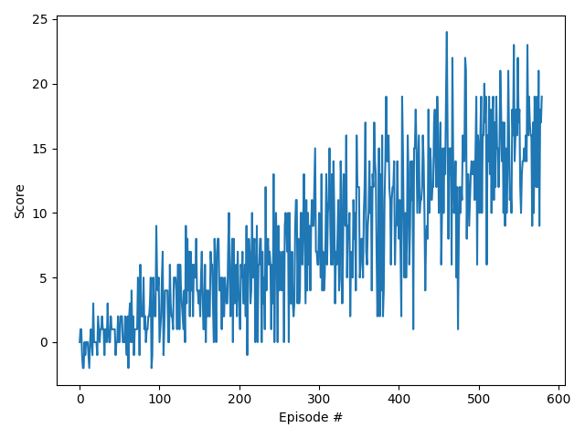

# Report: Navigation project

### Implementation
The `main.py` is the top level entry point that allows you to train the DQN agent or load the weights of a 
pre-trained agent and run this agent in the environment, choosing greedy actions from the trained policy.

The `DQN` class contains the code for the training loop. Every 200 episodes the current weights of the local network
are stored to a checkpoint file.

### Learning Algorithm
Uses DQN

The training was stopped when the average reward for the last 100 episodes was 
greater than the `reward_threshold` of 15.0.

The "Adam" algorithm was used for stochastic gradient descent, with a learning rate of 8e-4.

#### Neural Net architecture
For the Q network a neural net was used with 3 linear layers of size 48, 48 and 32 respectively, as well as an output layer. 

#### Hyper-parameters
The following hyper-parameters were experimented with, and the values used are given:

- gamma = 0.99  (discount rate)
- update_network_interval = 4 (how often to update the network)
- eps_end = 0.01 (final epsilon value)
- eps_decay = 0.0997 (epsilon decay)
- learning_rate = 8e-4 (learning rate for stochastic gradient descent)

### Results
The target average score of 15.0 was reached in 900 episodes.

