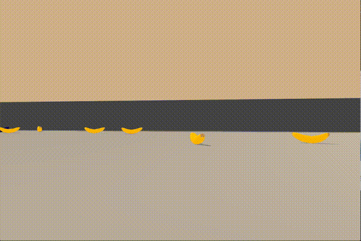

# Report: Navigation project

### Implementation
This is an implementation of vanilla DQN to solve the Banana task. It is based on the code from the DQN task, and 
therefore uses both a replay buffer for experience replay, and  a separate "target" neural network updated more slowly 
than the local network in order to avoid instability due to correlations.

The `main.py` is the top level entry point that allows you to train the DQN agent or load the weights of a 
pre-trained agent and run this agent in the environment, choosing greedy actions from the trained policy.

The `DQN` class in `dqn.py` contains the code for the training loop which loops over episodes. The inner loop then steps 
through timesteps in each episode, allowing the agent to choose an action then getting the reward from the environment and
updating the agent by calling the `agent.step()` function.

All the functionality for the DQN agent is inside the `Agent` class in `dqn_agent.py`. This contains the target and 
local neural network, as well as functions for sampling from the replay buffer to train the networks, choosing actions
based on an epsilon greedy algorithm, and soft updating the neural networks by calculating the loss as the difference
between the predicted Q values for the current state and the target Q values, based on the current reward and the target
values for the next state. PyTorch is then used to update the neural network weights based on the derivative of the loss.

#### Neural Network
The Neural Network can be found in `model.py`, it is a simple _"multi-layer perceptron"_ with 3 linear layers of size 
48, 32 and 32 respectively, as well as an output layer with the same dimension as the action space. 
It uses Relu activation units between each linear layer. 

#### Training details
The training was stopped when the average reward for the last 100 episodes was greater than the `reward_threshold` of 
15.0, which seemed to correspond to good performance on the task. When the average score achieved this threshold the 
training is automatically halted, and the final weights of the neural networks are written to a file. 
Additionally every 200 episodes the current weights of the local network are stored to a checkpoint file, in order to 
have a record of the weights during training. 

The "Adam" algorithm was used for stochastic gradient descent, with a learning rate of 8e-4.

#### Hyper-parameters
Different values of the following hyper-parameters were experimented with. The values below were found to give good 
performance, and these were used for the final run which generated the results in the next section (the score plot and gif):

- gamma = 0.99  (discount rate)
- update_network_interval = 4 (how often to update the network)
- eps_end = 0.01 (final epsilon value)
- eps_decay = 0.0997 (epsilon decay)
- learning_rate = 8e-4 (learning rate for stochastic gradient descent)

### Results
The target average score of 15.0 was reached in **480 episodes**.

### Ideas for future work
This project achieved decent performance with just a vanilla DQN algorithm, however there are many ways that this 
performance could potentially be improved. Some ideas are given below:

1. Try more advanced variants of the DQN algorithm, or other value based methods, such as Double DQN, Prioritized 
Experience Replay, Dueling DQN, or an approach that combines multiple variants such as _"Rainbow"_.

2. Experiment with different neural net architectures, for example Convolutional Neural Networks. It is expected that 
for the pixel-based task that CNNs would be required, since these are well suited to image data. However even in the 
current non-pixel task there must be some spatial correlation in the data that might benefit from using CNNs. 
Additionally there is no inherent reason why for small networks such as this that you actually need a neural network,
it would be very interesting to try using a different approach to function approximation to replace the neural network, 
for example a Gaussian Process.

3. Improved hyper-parameter tuning: the current hyperparameter values were found by manually trying different values,
 however an automatic hyper-parameter optimization process may be able to find better performing values, for example a 
 black box optimization algorithm such as bayesian optimization.